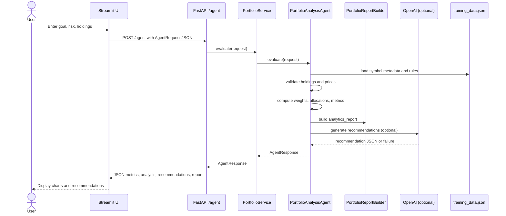

# Personalized Portfolio Advisor with What-If Simulation

This project follows a modular service-oriented structure for a clean separation between API endpoints,
portfolio logic, report generation, and model contracts.

## Structure

- app/api: FastAPI routes and application wiring
- app/services: orchestration and business service layer
- app/agents: portfolio evaluation logic and AI-assisted analysis
- app/reporting: analytics report builder
- app/models: request/response schemas
- data: portfolio metadata and scenario defaults
- tests: automated regression checks

## Goal
The analysis agent reads a financial goal, investor risk responses, and current holdings,
then computes portfolio analytics such as expected return, Sharpe ratio, asset-class allocation,
sector allocation, concentration, and scenario-based recommendations.

## Run

1. Install dependencies:
   pip install -r requirements.txt

2. Start the FastAPI backend:
   uvicorn main:app --reload --host 0.0.0.0 --port 8000

3. Start a Streamlit front end:
   streamlit run streamlit_app.py

4. Run the test cases:
   python -m pytest -q

## API

POST /agent
{
  "goal": {
    "name": "House down payment",
    "target_amount": 3000000,
    "time_horizon_years": 7,
    "monthly_contribution": 25000
  },
  "risk_responses": {
    "loss_tolerance_percent": 15,
    "income_stability": "stable",
    "investment_experience": "intermediate",
    "liquidity_need": "medium"
  },
  "holdings": [
    {
      "symbol": "ASSET_A",
      "quantity": 100,
      "current_price": 120,
      "purchase_price": 120,
      "history": [100, 101, 102, 103]
    }
  ],
  "scenario": "base"
}

## Mermaid Flow

## Notes
This project intentionally avoids LangSmith and LangChain libraries and keeps the code simple and clean.
