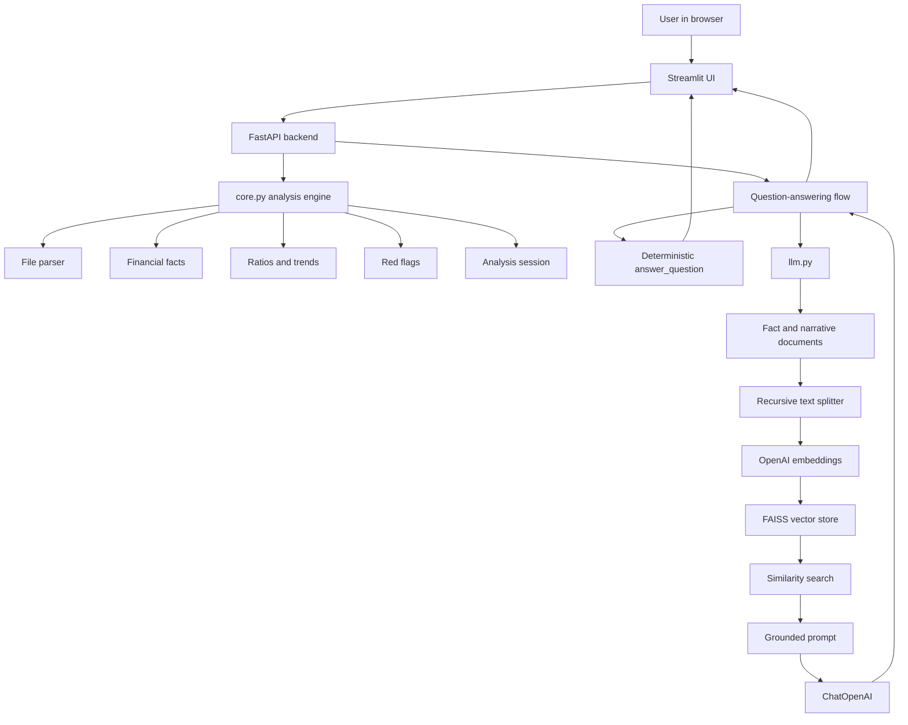

# Conversational Financial Statement Analyzer

## Ultimate Project Guide

This document explains the complete project in plain language and technical detail.
It covers the architecture, files, responsibilities, data flow, user flow, API flow,
financial calculations, embeddings, RAG, setup, and troubleshooting.

---

## 1. What This Project Does

The Conversational Financial Statement Analyzer accepts financial information from
CSV, Excel, PDF, TXT, and Markdown files. It turns that information into a useful
financial review.

The application can:

- Read uploaded financial statements and reports
- Identify supported financial metrics
- Calculate financial ratios
- Compare values across reporting periods
- Detect financial red flags
- Display an interactive dashboard
- Answer financial questions with citations
- Search long unstructured reports using embeddings and FAISS
- Use OpenAI for grounded natural-language answers when configured
- Continue working with deterministic answers when OpenAI is unavailable

In simple terms:

```text
Upload a financial report
        |
        v
Application understands the data
        |
        v
Application calculates financial indicators
        |
        v
Application identifies risks and trends
        |
        v
User asks questions in plain English
        |
        v
Application answers using the uploaded evidence
```

---

## 2. Why the Project Exists

Financial statements contain many numbers, periods, metrics, and narrative notes.
Reading them manually can be slow and makes comparisons difficult.

This project helps a user quickly answer questions such as:

```text
What is the latest current ratio?
How has operating margin changed?
Why is liquidity a concern?
What is the difference in revenue between 2019 and 2024?
What did management say about working capital?
```

The project combines two types of work:

1. **Deterministic financial analysis** for precise calculations.
2. **Retrieval-Augmented Generation** for searching narrative content and producing natural-language answers.

The deterministic part is the source of truth for calculations. The language model
is not trusted to invent or calculate financial values on its own.

---

## 3. High-Level Architecture



### Main layers

| Layer | Main responsibility |
|---|---|
| User interface | Collect uploads and questions and display results. |
| API layer | Connect the UI to backend logic through HTTP endpoints. |
| Analysis layer | Parse financial information and calculate results. |
| Retrieval layer | Split, embed, index, and retrieve relevant content. |
| Language-model layer | Generate grounded natural-language answers. |
| Data layer | Store facts, citations, sessions, and vector indexes. |

---

## 4. Project Structure

```text
cap2-conversational-financial-statement-analyzer/
|
|-- data/
|   |-- sample_financial_statement.csv
|   `-- large_unstructured_financial_report.txt
|
|-- financial_analyzer/
|   |-- __init__.py
|   |-- __main__.py
|   |-- api.py
|   |-- core.py
|   |-- embeddings.py
|   |-- llm.py
|   `-- streamlit_app.py
|
|-- requirements.txt
|-- .env
|-- DEMO_QUESTIONS.txt
|-- CAPSTONE_README.md
|-- FINANCIAL_ANALYZER_CODE_WALKTHROUGH.md
|-- EMBEDDINGS_AND_RAG_GUIDE.md
|-- PROJECT_FILE_GUIDE.md
|-- readme.txt
`-- ULTIMATE_PROJECT_GUIDE.md
```

---

## 5. File Responsibilities

### `financial_analyzer/core.py`

This is the main financial-analysis engine.

It is responsible for:

- Reading CSV, Excel, PDF, TXT, and Markdown inputs
- Normalizing labels such as `Sales` into `revenue`
- Cleaning numeric values such as `$1,200` or `(50)`
- Creating `Fact` objects
- Creating source citations
- Calculating 11 financial ratios
- Calculating period-over-period trends
- Detecting six red flags
- Answering common financial questions
- Resolving follow-up questions using conversation context
- Comparing analysis results

This file contains the core business rules. The UI and API should call this file
rather than duplicate financial formulas.

### `financial_analyzer/api.py`

This is the FastAPI backend.

It provides:

- `POST /analyze` for file upload and analysis
- `POST /ask` for questions about an analysis session
- `POST /compare` for comparing two analysis sessions

It also stores analysis results in the in-memory `SESSIONS` dictionary.

### `financial_analyzer/streamlit_app.py`

This is the browser-facing user interface.

It provides:

- Company name input
- File uploader
- Overview tab
- Latest financial metric cards
- Red-flag sections
- Ratios table
- Grounded Q&A chat
- Conversation history
- Error messages when FastAPI is unavailable

Streamlit does not perform the main analysis itself. It sends requests to FastAPI.

### `financial_analyzer/embeddings.py`

This is the embedding and vector-search utility module.

It is responsible for:

- Creating the OpenAI embedding client
- Turning financial facts into documents
- Splitting long narrative text into chunks
- Building FAISS vector stores
- Saving vector stores
- Loading vector stores
- Converting FAISS distance into relevance scores

### `financial_analyzer/llm.py`

This is the optional language-model and RAG module.

It is responsible for:

- Checking whether `OPENAI_API_KEY` exists
- Building or reusing a FAISS store for an analysis result
- Retrieving relevant financial facts and narrative chunks
- Building a grounded prompt
- Calling `gpt-4o-mini`
- Returning an answer and citations
- Falling back safely when OpenAI fails

### `financial_analyzer/__init__.py`

This makes the directory a Python package and exposes convenient imports:

```python
from financial_analyzer import analyze_upload, answer_question
```

It defines the package's public API through `__all__`.

### `financial_analyzer/__main__.py`

This is the package module entry point for:

```powershell
python -m financial_analyzer
```

It currently imports the FastAPI application. The normal run commands use
Uvicorn for FastAPI and Streamlit for the UI.

### `data/sample_financial_statement.csv`

This is the structured demo input.

It contains:

- Six periods from 2019 through 2024
- Revenue and profitability metrics
- Cash-flow metrics
- Receivables and inventory
- Liquidity metrics
- Debt and equity
- Interest expense

It produces 78 extracted facts, 11 ratios, and six red flags.

### `data/large_unstructured_financial_report.txt`

This is the long narrative demo input.

It contains:

- Management commentary
- Customer and collections discussion
- Inventory discussion
- Liquidity and capital-structure discussion
- Debt information
- Financial action plans
- Financial facts written as prose

It demonstrates text extraction, chunking, embeddings, and RAG.

### `requirements.txt`

This lists the Python packages required by the project, including:

- pandas for tabular data
- FastAPI for the backend
- Uvicorn for the API server
- Streamlit for the user interface
- LangChain for prompts, documents, embeddings, and vector stores
- FAISS for similarity search
- pdfplumber for PDF table extraction
- langchain-text-splitters for document chunking

### Documentation files

| File | Purpose |
|---|---|
| `CAPSTONE_README.md` | Project summary and architecture notes. |
| `FINANCIAL_ANALYZER_CODE_WALKTHROUGH.md` | Detailed implementation walkthrough. |
| `PROJECT_FILE_GUIDE.md` | File-by-file project guide. |
| `EMBEDDINGS_AND_RAG_GUIDE.md` | Focused embeddings and RAG explanation. |
| `DEMO_QUESTIONS.txt` | Validated questions for a demonstration. |
| `readme.txt` | Basic installation and run commands. |
| `ULTIMATE_PROJECT_GUIDE.md` | This complete architecture and operation guide. |

---

## 6. The Client-to-Backend-to-UI Flow

### Step 1: The user opens Streamlit

The user opens the Streamlit address in a browser. Streamlit renders the upload
sidebar and the analysis tabs.

### Step 2: The user uploads a file

The user provides:

- Company name
- CSV, Excel, PDF, TXT, or Markdown file

The user clicks **Analyze statements**.

### Step 3: Streamlit sends an HTTP request

`streamlit_app.py` calls `analyze_via_api()`.

The request goes to:

```text
POST http://localhost:8000/analyze
```

The request contains:

- Uploaded file bytes
- Original filename
- Company name
- Streamlit session ID

### Step 4: FastAPI receives the upload

`api.py` receives the request in the `analyze()` function.

It calls:

```python
result = analyze_upload(file_bytes, filename, company)
```

### Step 5: `core.py` parses the input

For structured files, `core.py` reads rows and columns.

For TXT and Markdown files, it searches the prose for supported statements such as:

```text
Revenue was $1,200 million in 2024.
```

This becomes a fact containing:

- Company
- Metric
- Period
- Numeric value
- Statement type
- Source filename

### Step 6: `core.py` calculates the analysis

The facts are used to calculate ratios, trends, and red flags.

The resulting `AnalysisResult` contains:

- Company name
- Periods
- Facts
- Ratios
- Trends
- Red flags
- Narrative summary
- Optional source text for unstructured reports

### Step 7: FastAPI stores the session

FastAPI stores the result in:

```python
SESSIONS[session_id] = result
```

This lets later questions refer to the uploaded analysis.

### Step 8: FastAPI returns JSON

The result is converted to a dictionary and returned to Streamlit.

### Step 9: Streamlit renders the dashboard

Streamlit displays:

- Executive summary
- Latest ratio cards
- Red flags
- Evidence citations
- Ratio table

### Step 10: The user asks a question

The user enters a question in the Q&A tab.

Streamlit sends:

```text
POST http://localhost:8000/ask
```

The request contains:

- Session ID
- Current question
- Previous conversation messages

### Step 11: FastAPI retrieves the session

FastAPI finds the `AnalysisResult` using the session ID.

If the session does not exist, it returns a 404 error.

### Step 12: The answer path is selected

The application first uses deterministic logic for recognized financial questions.

Examples:

- Current ratio
- Debt-to-equity
- Revenue differences
- Red-flag explanations
- Trend questions

For other questions, the optional OpenAI/RAG path can be used when an API key
is configured.

### Step 13: Streamlit displays the answer

The answer and citations are appended to the chat history and shown to the user.

---

## 7. Supported Input Types

### CSV and Excel

These are expected to have metrics in the first column and periods in the remaining
columns.

Example:

```csv
Metric,2022,2023,2024
Revenue,1000,1100,1200
Net Income,110,105,95
Current Assets,600,560,500
Current Liabilities,500,540,600
```

### PDF

The application uses `pdfplumber` to extract tables from PDF pages.

The PDF should contain a recognizable table. A scanned image-only PDF may require
OCR before it can be analyzed.

### TXT and Markdown

The application searches prose for dated metric statements.

Supported example:

```text
Revenue was $1,200 million in 2024.
Current assets were $500 million in 2024.
Total debt was $1,300 million in 2024.
```

The text parser extracts the metric, value, and year, while the full report is
also preserved for narrative chunking and retrieval.

---

## 8. Financial Facts and Citations

A `Fact` is the normalized representation of one financial value.

Conceptually:

```python
Fact(
    company="My Company",
    metric="revenue",
    period="2024",
    value=1200.0,
    statement="Financial statements",
    source="sample_financial_statement.csv",
)
```

Each fact can produce a citation:

```text
[My Company | Financial statements | revenue | 2024 | sample_financial_statement.csv]
```

Citations are important because the user can trace an answer back to its source.

---

## 9. Ratios and Trends

The application calculates 11 ratios.

| Ratio | Meaning |
|---|---|
| Current ratio | Current assets divided by current liabilities. |
| Debt-to-equity | Total debt divided by total equity. |
| Debt ratio | Total debt divided by total assets. |
| Gross margin | Gross profit divided by revenue, expressed as a percentage. |
| Operating margin | Operating income divided by revenue, expressed as a percentage. |
| Net margin | Net income divided by revenue, expressed as a percentage. |
| DSO | Accounts receivable divided by revenue, multiplied by 365. |
| Inventory-to-revenue | Inventory divided by revenue. |
| Cash flow to net income | Cash from operations divided by net income. |
| Return on assets | Net income divided by total assets, expressed as a percentage. |
| Return on equity | Net income divided by total equity, expressed as a percentage. |

For ratios with at least two periods, the application calculates:

- Direction
- Absolute change
- Percentage change
- First period value
- Latest period value

---

## 10. Red Flags

The application checks six risk patterns.

### Accrual-quality gap

Triggered when cash from operations is below net income in the latest period.

Possible meaning: reported earnings are not converting into cash effectively.

### DSO climbing

Triggered when days sales outstanding increases from one period to the next.

Possible meaning: customers are taking longer to pay.

### Margin compression

Triggered when operating margin declines across available periods.

Possible meaning: costs are increasing faster than operating income.

### Leverage stress

Triggered when debt is greater than equity in the latest period.

Possible meaning: the company relies heavily on borrowed capital.

### Inventory build-up

Triggered when inventory grows faster than revenue.

Possible meaning: stock may be moving slowly or cash may be tied up in inventory.

### Liquidity deterioration

Triggered when current assets are below current liabilities in the latest period.

Possible meaning: short-term obligations may not be fully covered by short-term assets.

---

## 11. Embeddings and Chunking

### What is an embedding?

An embedding converts text into a vector of numbers. Similar meanings tend to have
vectors that are close together.

The project uses:

```python
EMBEDDING_MODEL = "text-embedding-3-small"
```

### Where the embedding client is created

In `embeddings.py`:

```python
def create_embeddings(model: str = EMBEDDING_MODEL):
    require_api_key()
    return OpenAIEmbeddings(model=model)
```

This prepares the OpenAI embedding client.

The actual document vectors are generated when the documents are passed into:

```python
FAISS.from_documents(...)
```

### Where splitting happens

The project uses:

```python
RecursiveCharacterTextSplitter(
    chunk_size=500,
    chunk_overlap=50,
)
```

Short financial facts remain intact. Long narrative reports are divided into
smaller overlapping chunks.

The overlap helps retain meaning when a sentence crosses a chunk boundary.

### What gets indexed

The vector store can contain:

1. Structured financial fact documents.
2. Narrative chunks from TXT and Markdown reports.

Each item contains citation or source metadata.

---

## 12. RAG: Retrieval-Augmented Generation

RAG has three stages.

### Retrieval

FAISS searches the vector store:

```python
documents = store.similarity_search(question, k=8)
```

It returns the most relevant facts or narrative chunks.

### Augmentation

The retrieved content is inserted into the grounded prompt:

```text
Facts:
- revenue | 2024 | 1200
- current assets | 2024 | 500
- current liabilities | 2024 | 600
```

### Generation

`ChatOpenAI` uses the retrieved context to produce a concise answer.

The prompt tells the model:

- Use only the supplied facts.
- Do not invent unsupported information.
- Say when the uploaded information does not answer the question.
- Include sources.

### RAG flow

```text
Question
   |
   v
Embedding for the question
   |
   v
FAISS similarity search
   |
   v
Relevant chunks
   |
   v
Grounded prompt
   |
   v
ChatOpenAI
   |
   v
Answer with citations
```

The FAISS store is currently cached in memory:

```python
_FACT_STORES: dict[int, FAISS] = {}
```

It is lost when the FastAPI process restarts. Persistent save/load helpers exist
for future use.

---

## 13. Deterministic Q&A Versus RAG Q&A

### Deterministic Q&A

The deterministic path is best for exact financial calculations.

Example:

```text
What is the difference in revenue between 2019 and 2024?
```

The application reads the stored facts and calculates:

```text
1200 - 720 = 480
```

This does not require an API key or embeddings.

### RAG Q&A

The RAG path is best for semantic questions about narrative content.

Examples:

```text
What actions did management propose to improve cash conversion?
Why did the company become concerned about working capital?
What customer behavior affected liquidity?
```

The system retrieves narrative chunks and sends them to the language model.

Both paths are useful. The deterministic path protects calculation accuracy, while
RAG helps the application understand longer, less structured reports.

---

## 14. Runtime Components

### FastAPI process

Command:

```powershell
.\.venv\Scripts\python.exe -m uvicorn financial_analyzer.api:app --reload
```

Default address:

```text
http://localhost:8000
```

Responsibilities:

- Receive uploads
- Run analysis
- Store sessions
- Receive questions
- Return answers

### Streamlit process

Command:

```powershell
.\.venv\Scripts\python.exe -m streamlit run financial_analyzer\streamlit_app.py
```

Default address:

```text
http://localhost:8501
```

Responsibilities:

- Render the browser UI
- Upload files
- Show analysis results
- Send questions to FastAPI
- Display answers and citations

Both processes are required for the current architecture because Streamlit uses
FastAPI for analysis and Q&A.

---

## 15. Setup

### Create or activate the virtual environment

```powershell
py -3.12 -m venv .venv
.\.venv\Scripts\activate
```

### Install dependencies

```powershell
python -m pip install --upgrade pip
pip install -r requirements.txt
```

### Configure OpenAI

Create or update `.env`:

```text
OPENAI_API_KEY=your_key_here
```

The deterministic analyzer works without this key. OpenAI embeddings and RAG
require the key.

### Start the application

Terminal 1:

```powershell
.\.venv\Scripts\python.exe -m uvicorn financial_analyzer.api:app --reload
```

Terminal 2:

```powershell
.\.venv\Scripts\python.exe -m streamlit run financial_analyzer\streamlit_app.py
```

Open the Streamlit URL shown in the terminal.

---

## 16. Demonstration Procedure

### Structured-data demonstration

1. Start FastAPI.
2. Start Streamlit.
3. Upload `data/sample_financial_statement.csv`.
4. Enter `My Company`.
5. Click **Analyze statements**.
6. Review the Overview tab.
7. Review the Ratios tab.
8. Ask questions in the Grounded Q&A tab.

Suggested questions:

```text
What is the current ratio?
How has operating margin changed?
What is the difference in revenue between 2019 and 2024?
Why is liquidity a concern?
```

### Unstructured-data demonstration

1. Upload `data/large_unstructured_financial_report.txt`.
2. Enter `Northstar Industrial Systems`.
3. Click **Analyze statements**.
4. Ask:

```text
What actions did management propose to improve cash conversion?
What customer behavior affected liquidity?
Why did management become concerned about working capital?
What was the difference in revenue between 2019 and 2024?
```

The first three questions demonstrate narrative retrieval. The last question
demonstrates deterministic financial calculation.

---

## 17. Testing

### Compile the application

```powershell
.\.venv\Scripts\python.exe -m py_compile financial_analyzer\core.py financial_analyzer\api.py financial_analyzer\streamlit_app.py financial_analyzer\embeddings.py financial_analyzer\llm.py
```

### Test structured analysis

```powershell
.\.venv\Scripts\python.exe -c "from pathlib import Path; from financial_analyzer.core import analyze_upload; r=analyze_upload(Path('data/sample_financial_statement.csv').read_bytes(),'sample_financial_statement.csv','My Company'); print(len(r.facts), len(r.ratios), len(r.red_flags))"
```

### Test unstructured analysis

```powershell
.\.venv\Scripts\python.exe -c "from pathlib import Path; from financial_analyzer.core import analyze_upload; p=Path('data/large_unstructured_financial_report.txt'); r=analyze_upload(p.read_bytes(),p.name,'Northstar Industrial Systems'); print(len(r.facts), len(r.periods), len(r.red_flags))"
```

### Test chunking

```powershell
.\.venv\Scripts\python.exe -c "from langchain_text_splitters import RecursiveCharacterTextSplitter; s=RecursiveCharacterTextSplitter(chunk_size=20,chunk_overlap=5); print(s.split_text('Revenue increased strongly over several reporting periods.'))"
```

The validated project currently supports:

- 27 direct demo questions
- 3 follow-up sequences
- 11 ratios
- 6 red flags
- 78 structured facts from the CSV
- 106 extracted facts from the unstructured report
- 33 narrative chunks from the unstructured report

---

## 18. Error Handling and Common Problems

### FastAPI request failed

Cause: FastAPI is not running or is running on a different port.

Fix:

```powershell
.\.venv\Scripts\python.exe -m uvicorn financial_analyzer.api:app --reload
```

### OpenAI is not configured

Cause: `.env` does not contain `OPENAI_API_KEY`.

Effect: deterministic answers still work, but OpenAI embeddings and RAG are skipped.

### Analysis session not found

Cause: FastAPI restarted and its in-memory `SESSIONS` dictionary was cleared.

Fix: upload the document again in Streamlit.

### No supported financial metrics found

Cause: the input does not contain supported labels or supported prose patterns.

Use labels such as:

```text
Revenue
Net Income
Current Assets
Current Liabilities
Total Debt
Total Equity
```

For narrative reports, use sentences such as:

```text
Revenue was $1,200 million in 2024.
```

### PDF has no table

Cause: the PDF may be scanned or may not contain extractable tables.

Fix: use a text-based PDF or convert it to CSV/TXT first.

---

## 19. Design Principles

### Single source of truth

Financial formulas belong in `core.py`.

### Grounded answers

Answers should be based on uploaded facts and citations.

### Deterministic calculations

Ratios and differences should be calculated by Python rather than guessed by a model.

### Graceful degradation

The application should remain useful without OpenAI by using deterministic answers.

### Separation of responsibilities

The UI, API, analysis engine, retrieval system, and language-model layer have
separate jobs.

### Reusable retrieval infrastructure

The embedding and FAISS utilities are kept in their own module so they can be
reused by future agents or document workflows.

---

## 20. One-Minute Explanation

This is a financial analysis application with a Streamlit front end and a FastAPI
backend. The user uploads a financial statement or a long narrative report.
FastAPI sends the file to `core.py`, which extracts facts, calculates ratios,
identifies trends, and detects red flags. Streamlit displays the results.

When the user asks a question, the application first uses deterministic logic for
known financial calculations. For narrative questions, it can split the report
into chunks, create embeddings, search the relevant chunks with FAISS, and give
those chunks to OpenAI as grounded context. The final response includes citations
so the user can understand where the answer came from.
